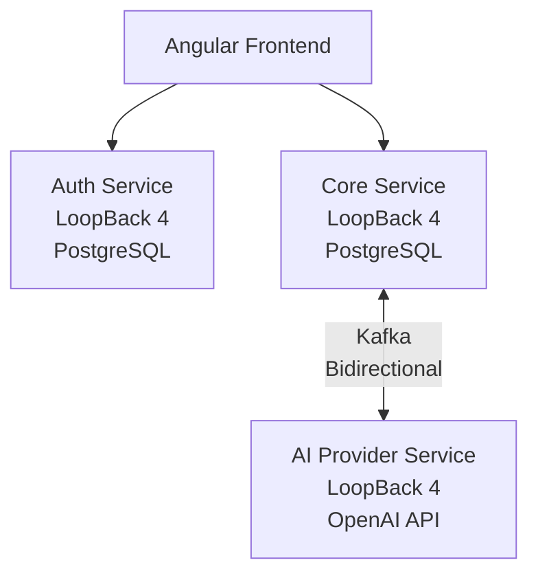

# Finsight

**Personal finance, made intelligent.**

Finsight is an AI-powered personal finance platform that helps you understand where your money goes. Track income and expenses, explore spending analytics, and receive AI-generated financial insights — built on a production-grade microservices architecture.

---

## Why Finsight

Most finance trackers show you data. Finsight interprets it. Powered by OpenAI and an event-driven backend, Finsight generates personalized financial insights on a nightly cadence — without the cost and complexity of real-time AI calls on every transaction.

---

## Architecture at a Glance

Three independent microservices, each with its own database. AI insight generation is fully asynchronous via Kafka — decoupled from the user-facing request path entirely.

---

## Tech Stack

| Layer | Technology |
|---|---|
| Frontend | Angular 19+, TypeScript, Signals |
| Backend | LoopBack 4, Node.js, TypeScript |
| Database | PostgreSQL (per service) |
| Messaging | Apache Kafka |
| AI | OpenAI API (`gpt-4o-mini`) |
| Auth | JWT, bcrypt |
| Infra | Docker, Docker Compose |

---

## Key Features

- Manual transaction entry
- Income and expense tracking with custom categories
- Analytics: monthly trends, category breakdowns, income vs. expense charts
- AI-generated financial insights via nightly cron and on-demand trigger
- Fully async AI pipeline — insight generation never blocks the user experience
- Cost-aware architecture: batched AI calls, server-side debounce, pre-aggregated prompts

---

## Documentation

For a full breakdown of service boundaries, database schemas, Kafka message contracts, API design, security model, cost management strategy, and architectural decision log:

→ [Architecture.md](./docs/Architecture.md)

---

## Project Status

Active development — MVP in progress. This is a portfolio project demonstrating full-stack engineering with microservices, event-driven architecture, and production-grade AI integration.

---

*Built with Angular · LoopBack 4 · PostgreSQL · Kafka · OpenAI*