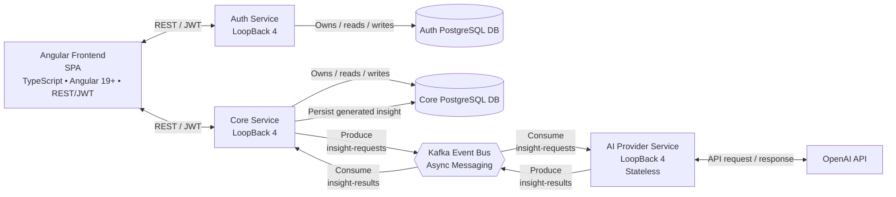

# Finsight — Architecture Document

**Version:** 1.0
**Status:** Living Document — subject to revision as the system evolves
**Author:** Barleen

---

## Table of Contents

1. [Project Overview](#1-project-overview)
2. [Goals & Design Philosophy](#2-goals--design-philosophy)
3. [System Architecture Overview](#3-system-architecture-overview)
4. [Microservices](#4-microservices)
5. [Database Design](#5-database-design)
6. [Asynchronous Communication — Kafka](#6-asynchronous-communication--kafka)
7. [AI Integration](#7-ai-integration)
8. [Frontend — Angular](#8-frontend--angular)
9. [Security Model](#9-security-model)
10. [Cost Management Strategy](#10-cost-management-strategy)
11. [MVP Scope](#11-mvp-scope)
12. [Technology Stack](#12-technology-stack)
13. [Architectural Decision Log](#13-architectural-decision-log)

---

## 1. Project Overview

Finsight is a personal finance intelligence platform that helps users track income and expenses, visualize spending patterns through rich analytics, and receive AI-generated financial insights.

The system is built on a production-grade microservices architecture with event-driven communication, service-level data isolation, and a cost-aware AI integration strategy. It is intentionally designed the way a real fintech product would be — not as a tutorial app — and reflects both engineering depth and product thinking across every architectural decision.

---

## 2. Goals & Design Philosophy

### Primary Goals

- Give users a clear, actionable view of their financial health over time.
- Surface AI-generated insights on a scheduled cadence, keeping the experience meaningful and the system cost-efficient.
- Demonstrate a defensible, production-realistic microservices architecture with async messaging, service isolation, and structured AI integration.

### Core Design Principles

**Data ownership defines service boundaries.** Each microservice owns its data exclusively. No two services share a database. Cross-service data access happens via API contract, never via shared schema. This is the foundational principle behind every service boundary decision in this system.

**Cost efficiency is a first-class architectural constraint.** AI inference is not free. The system batches AI calls, avoids per-transaction invocations, and decouples insight generation entirely from the user-facing request path. This is a deliberate product and engineering decision, not a limitation.

**Fault isolation between domains.** A failure in AI insight generation must never degrade the core transaction and analytics experience. These are treated as independent operational concerns with independent failure modes.

**Stateless AI, stateful Core.** The AI Provider Service holds no database and no memory between requests — each Kafka message it receives is self-contained, processed independently, and forgotten. The Core Service, by contrast, owns all persisted data including the insights table. This separation keeps the AI service simple and independently replaceable — swapping the AI provider requires no data migration, no schema changes, and no impact on any other service.

**Async over sync for non-real-time work.** Insight generation happens on a schedule, not in a request/response cycle. Kafka provides temporal decoupling, natural resilience, and backpressure handling between the Core Service and the AI Provider Service.

---

## 3. System Architecture Overview

Each service is an independent Node.js process with its own PostgreSQL database. Services do not share schemas. All AI-related communication is fully asynchronous via Kafka. Synchronous REST is used only for user-facing request paths.



---

## 4. Microservices

### 4.1 Auth Service

**Responsibility:** Owns user identity and session lifecycle. Issues, rotates, and verifies JWTs; manages user records and refresh tokens. Implemented with LoopBack 4.

**Runtime behaviour (actual implementation):**

- The HTTP controllers are thin and delegate business logic to a `UserService` class which implements registration, login, refresh, and logout flows.
- Passwords are hashed using `bcrypt` with the cost factor drawn from `process.env.BCRYPT_ROUNDS` (exposed in code as `ROUNDS`).
- Access and refresh tokens are JWTs produced with `jsonwebtoken`. Expiry values are configured as integer seconds via `JWT_ACCESS_TOKEN_EXPIRY_IN_SECONDS` and `JWT_REFRESH_TOKEN_EXPIRY_IN_SECONDS` environment variables.
- On login a refresh token is created and persisted to the `refresh_tokens` table (the code stores the token value in the `token` column). The refresh token is later looked up by exact token value when exchanging or revoking.
- The refresh flow verifies the provided refresh token, ensures it exists in the DB, deletes the old row, and inserts a rotated refresh token with a new expiry.
- Logout is implemented by deleting stored refresh token rows matching the provided token (no separate `revoked` flag in the current implementation).

**Database tables (summary):**

users (id, email, password_hash, name, created_at, updated_at)
refresh_tokens (id, user_id, token, expires_at, created_at)

**API (implemented endpoints):**

| Method | Path             | Description                                                                     |
| ------ | ---------------- | ------------------------------------------------------------------------------- |
| POST   | `/auth/register` | Create a new user account (returns id, name, email, createdAt)                  |
| POST   | `/auth/login`    | Authenticate, receive `accessToken` + `refreshToken`                            |
| POST   | `/auth/refresh`  | Exchange a valid refresh token for a new access token and rotated refresh token |
| POST   | `/auth/logout`   | Revoke (delete) the provided refresh token                                      |

**Key decisions & notes (current):**

- Access tokens are short-lived by default (15 minutes) and validated locally by downstream services using the shared JWT secret — no network round-trip to Auth Service on each request.
- Refresh tokens are longer-lived (default 7 days) and persisted to the database so they can be rotated and deleted (revoked) server-side.
- Refresh tokens are stored in the `token` column (the running implementation persists the raw token string). If you later want to store a hash instead, the service code and model/table must be updated consistently.
- Passwords are hashed with `bcrypt`; the cost factor is configurable via environment variables.

---

### 4.2 Core Service

**Responsibility:** The domain heart of Finsight. Owns all financial data — transactions, categories, analytics, and insights. Coordinates insight generation by publishing to Kafka and consuming results.

Current implementation exposes authenticated transaction CRUD plus authenticated category read endpoints. Categories are seeded during migration from a default category list defined in `src/seeds/category.seed.ts`.

**Database tables:**
transactions (id, user_id, amount, category_id, description, created_at, updated_at)
categories (id, user_id, name, type, is_discretionary, created_at)
insights (id, user_id, content, insight_type, status, generated_at, created_at)
insight_requests (id, user_id, requested_at, debounce_expires_at)

The `status` column on `insights` cycles through `pending → ready | failed`.

The `insight_requests` table enforces the debounce window — before publishing a Kafka message on a manual trigger, the service checks whether a request exists within the cooldown period for that user.

**Insight coordination flow:**

1. Nightly cron fires. For each active user with transactions in the past 30 days, the Core Service assembles a financial summary payload and publishes it to `insight-requests`.
2. Alternatively, a user hits `POST /insights/trigger`. The service checks `insight_requests` for a recent entry within the debounce window. If none exists, it publishes. If one exists, it returns a `429` with the time remaining.
3. The Core Service also runs as a Kafka consumer on `insight-results`. When a result arrives, it writes the content to the `insights` table and updates `status` to `ready` or `failed`.

All transaction and category access is scoped by the authenticated user's `user_id`, extracted from the JWT bearer token.

**API:**

| Method | Path                            | Description                                     |
| ------ | ------------------------------- | ----------------------------------------------- |
| GET    | `/transactions`                 | List transactions for authenticated user        |
| POST   | `/transactions`                 | Create a transaction                            |
| PUT    | `/transactions/:id`             | Update a transaction                            |
| DELETE | `/transactions/:id`             | Delete a transaction                            |
| GET    | `/categories`                   | List categories                                 |
| GET    | `/categories/count`             | Count categories                                |
| GET    | `/categories/{id}`              | Fetch a single category                         |
| POST   | `/categories`                   | Create a custom category                        |
| GET    | `/analytics/summary`            | Monthly income/expense summary                  |
| GET    | `/analytics/trends`             | Spending trends over a rolling period           |
| GET    | `/analytics/category-breakdown` | Spend breakdown by category                     |
| GET    | `/insights`                     | Fetch latest AI insights for the user           |
| POST   | `/insights/trigger`             | Manually trigger insight generation (debounced) |

**Current implementation notes:**

- The Core Service uses LoopBack's authentication component and a custom JWT strategy to verify bearer tokens locally using `jsonwebtoken` and the shared `JWT_SECRET`.
- Category read endpoints are currently implemented (`GET /categories`, `GET /categories/{id}`, `GET /categories/count`); category write endpoints remain part of the broader designed API surface.
- Default categories are seeded during migration by `src/seeds/category.seed.ts`, which inserts missing defaults without duplicating existing entries.
- On create, each transaction is persisted with the requesting user's `userId`.
- All read, update, and delete operations filter by `userId` to prevent cross-user access.

---

### 4.3 AI Provider Service

**Responsibility:** Stateless insight generation. Consumes from `insight-requests`, calls the OpenAI API, publishes to `insight-results`. No database. No user state. No persistence of any kind.

**Why stateless?** Each Kafka message is self-contained — it carries a pre-assembled financial summary built by the Core Service. The AI Provider Service never queries anything. This makes the service trivially replaceable: swapping OpenAI for a different provider requires only changes inside this service, with zero impact on data models or other services.

**Flow:**

1. Consume message from `insight-requests`.
2. Extract `financial_summary` from the payload.
3. Construct prompt, call OpenAI Chat Completions API.
4. Publish result to `insight-results`.
5. On failure, publish `status: failed` so the Core Service can update the insight record and avoid leaving it in a permanent `pending` state.

---

## 5. Database Design

Each service has its own PostgreSQL instance. There are no cross-service foreign key constraints — referential integrity at service boundaries is enforced at the application layer via verified JWT `user_id` extraction.

### Auth Service DB

```sql
CREATE TABLE users (
  id UUID PRIMARY KEY DEFAULT gen_random_uuid(),
  email VARCHAR(255) UNIQUE NOT NULL,
  password_hash VARCHAR(255) NOT NULL,
  name VARCHAR(255) NOT NULL,
  created_at TIMESTAMPTZ DEFAULT NOW(),
  updated_at TIMESTAMPTZ DEFAULT NOW()
);

CREATE TABLE refresh_tokens (
  id UUID PRIMARY KEY DEFAULT gen_random_uuid(),
  user_id UUID NOT NULL REFERENCES users(id) ON DELETE CASCADE,
  token TEXT UNIQUE NOT NULL,
  expires_at TIMESTAMPTZ NOT NULL,
  created_at TIMESTAMPTZ DEFAULT NOW()
);
```

### Core Service DB

```sql
CREATE TABLE categories (
  id UUID PRIMARY KEY DEFAULT gen_random_uuid(),
  user_id UUID NOT NULL,
  name VARCHAR(100) NOT NULL,
  type SMALLINT NOT NULL,
  is_discretionary BOOLEAN DEFAULT TRUE,
  created_at TIMESTAMPTZ DEFAULT NOW()
);

-- Default categories are seeded during migration by src/seeds/category.seed.ts

CREATE TABLE transactions (
  id UUID PRIMARY KEY DEFAULT gen_random_uuid(),
  user_id UUID NOT NULL,
  amount NUMERIC(12, 2) NOT NULL,
  category_id UUID REFERENCES categories(id),
  description TEXT,
  created_at TIMESTAMPTZ DEFAULT NOW(),
  updated_at TIMESTAMPTZ DEFAULT NOW()
);

CREATE TABLE insights (
  id UUID PRIMARY KEY DEFAULT gen_random_uuid(),
  user_id UUID NOT NULL,
  content TEXT,
  insight_type VARCHAR(50),
  status VARCHAR(20) DEFAULT 'pending'
    CHECK (status IN ('pending', 'ready', 'failed')),
  generated_at TIMESTAMPTZ,
  created_at TIMESTAMPTZ DEFAULT NOW()
);

CREATE TABLE insight_requests (
  id UUID PRIMARY KEY DEFAULT gen_random_uuid(),
  user_id UUID NOT NULL,
  requested_at TIMESTAMPTZ DEFAULT NOW(),
  debounce_expires_at TIMESTAMPTZ NOT NULL
);
```

The `user_id` columns in the Core Service DB reference the Auth Service's `users.id` logically, but not via a database-level constraint. Enforcing a foreign key across service databases would couple the two databases operationally, which defeats the purpose of service isolation.

---

## 6. Asynchronous Communication — Kafka

### Why Kafka over direct REST

Insight generation is background work — it does not need to happen in real time.

The alternative would be a synchronous REST call from the Core Service to the AI Provider Service at cron-trigger time. The problem with that is availability coupling: if the AI Provider Service is slow or down when the cron fires, the Core Service blocks and waits. You now need retry logic, timeout handling, and error recovery all in the cron job itself. A failure in one service directly impacts the other.

Kafka eliminates that dependency entirely. The Core Service publishes a message and moves on immediately — it does not wait for the AI Provider Service to respond, or even to be running. The AI Provider Service consumes and processes messages at its own pace. If it goes down, messages queue up in the topic and are processed when it recovers. Neither service needs to know anything about the other's availability.

This is the canonical use case for async messaging: two services that need to exchange data but have no reason to be available at the same time.

### Topics

| Topic              | Producer            | Consumer            | Purpose                                          |
| ------------------ | ------------------- | ------------------- | ------------------------------------------------ |
| `insight-requests` | Core Service        | AI Provider Service | Deliver financial summary for insight generation |
| `insight-results`  | AI Provider Service | Core Service        | Return generated insight or failure signal       |

### `insight-requests` message schema

```json
{
  "user_id": "uuid",
  "requested_at": "2024-11-01T02:00:00Z",
  "financial_summary": [
    {
      "period": "2024-10",
      "total_income": 5200.0,
      "total_expenses": 3850.0,
      "net": 1350.0,
      "top_categories": [
        { "name": "Dining", "amount": 620.0 },
        { "name": "Vacation", "amount": 2500.0 }
      ]
    },
    {
      "period": "2024-09",
      "total_income": 4900.0,
      "total_expenses": 4100.0,
      "net": 800.0,
      "top_categories": [
        { "name": "Dining", "amount": 550.0 },
        { "name": "Personal Care", "amount": 250.0 }
      ]
    }
  ]
}
```

The financial summary is fully assembled by the Core Service before publishing. The AI Provider Service consumes this as-is and never queries any database.

### `insight-results` message schema

```json
{
  "user_id": "uuid",
  "status": "ready",
  "content": "Your dining spend increased 12.5% this month...",
  "generated_at": "2024-11-01T02:00:14Z"
}
```

---

## 7. AI Integration

### Provider & Model

OpenAI API via a dedicated `platform.openai.com` account. Default model: `gpt-4o-mini`, selected for the quality-to-cost ratio on structured financial summarization tasks. Model is configurable via `OPENAI_MODEL` environment variable to allow upgrades or provider swaps without code changes.

### Prompt Design

The AI Provider Service constructs a prompt from the financial summary payload, engineered to elicit specific and actionable insights rather than generic observations.

You are a concise personal finance advisor. Analyze the following monthly
financial summary and return exactly 3 actionable insights.
Period: {period}
Income: ${total_income}
Expenses: ${total_expenses}
Net: ${net}
MoM Net Change: {mom_net_delta_pct}%
Top spending categories:
{categories}
Respond ONLY with a valid JSON array, no preamble, no markdown:
[{ "title": "...", "detail": "..." }]
Each detail must be under 80 words. Reference specific numbers from the data.

Responses are parsed as JSON. If parsing fails or OpenAI returns an error, the AI Provider Service publishes a `status: failed` result. The Core Service marks the insight record accordingly, ensuring no record is left in a permanent `pending` state.

### Trigger Strategy

**Nightly cron (automatic):** Runs at 2:00 AM server time. For each user with at least one transaction in the past 30 days, the Core Service assembles a financial summary and publishes an insight request. This is the primary mechanism — users receive fresh insights without any action required.

**Manual trigger (user-initiated):** `POST /insights/trigger`, debounced to once per hour per user via the `insight_requests` table. If a request exists within the cooldown window, the endpoint returns `429` with the time remaining. If not, a Kafka message is published and a new record is written.

Per-transaction triggering is explicitly not implemented. See ADR-004.

---

## 8. Frontend — Angular

### Framework

Angular 19+ with standalone components, signals, and the `@if` / `@for` control flow syntax. NgModules are not used. This reflects current Angular best practices, not legacy patterns.

### Feature Areas

**Auth:** Login, registration, JWT storage, HTTP interceptor for Bearer token attachment, route guard for protected pages.

**Dashboard:** Summary cards (monthly income, expenses, net savings), recent transactions list, quick-add transaction form.

**Transactions:** Full list with filtering by date, category, and type. Create / edit / delete. CSV import with column mapping UI.

**Analytics:** Monthly income vs. expense bar chart, category breakdown doughnut chart, 6–12 month spending trend line chart.

**Insights:** Displays the most recent AI-generated insights with generation timestamp. "Refresh Insights" button calls `POST /insights/trigger` and handles the debounce response gracefully with user-facing feedback.

### State Management

Angular Signals are used as the primary state management primitive — they are
built into Angular 17+ and handle local and shared component state cleanly
without additional libraries. RxJS `BehaviorSubject` is used where HTTP streams
and async data flows are more naturally expressed reactively, such as in service
layers communicating with the API. NgRx is deliberately deferred — it would be
appropriate if state complexity grows significantly across the analytics and
insights domains, but adds unnecessary overhead at this scope.

### API Layer

Each domain has a dedicated Angular service (`AuthService`, `TransactionService`, `InsightService`, etc.) that encapsulates all HTTP calls. A single `HttpClient` interceptor handles token attachment. All services point to a configurable base URL via Angular environment files so the backend configuration can change without touching service code.

---

## 9. Security Model

**JWT authentication:** Short-lived access tokens (15 min) issued by Auth Service. Core Service validates tokens locally using the shared secret — no network round-trip to Auth Service on every request. The current implementation uses LoopBack's `AuthenticationComponent` and a custom JWT strategy backed by `jsonwebtoken`.

**Data scoping:** Every Core Service database query is filtered by `user_id` extracted from the verified JWT. Users can only read and write their own data. There is no mechanism to enumerate another user's records via the API.

**Password security:** bcrypt with cost factor 12. Plaintext passwords are never logged or persisted anywhere in the system.

**Secrets management:** OpenAI API key, JWT secret, and database credentials are stored as environment variables. `.env` is gitignored. `.env.example` with placeholder values is committed to the repository.

**CORS:** Each service explicitly allows only the frontend origin in production configuration.

**Input validation:** LoopBack 4 model validation on all incoming request bodies. No raw SQL. All database access via the LoopBack Repository pattern.

---

## 10. Cost Management Strategy

**Batch, don't trigger per event.** Insights are generated at most once per user per day via the nightly cron. A single OpenAI call per active user per day is the steady-state target.

**Pre-aggregate before the AI call.** The financial summary payload is pre-computed and structured by the Core Service before being published to Kafka. The AI Provider Service receives a compact payload — not raw transaction rows — minimizing prompt token count.

**Server-side debounce on manual triggers.** One manual trigger per user per hour, enforced at the database level, not just the frontend.

**Model selection.** `gpt-4o-mini` by default. Significantly cheaper than GPT-4o for structured summarization with no meaningful quality difference for this use case.

**Response length cap.** The prompt instructs the model to keep each insight under 80 words. `max_tokens` is set explicitly in every API call to prevent runaway responses.

---

## 11. MVP Scope

### In Scope

- User registration and login with JWT auth
- Manual transaction entry (income and expense)
- Transaction categorisation with sensible default categories
- Dashboard with current month summary
- Analytics: monthly trend, category breakdown, income vs. expense charts
- AI insight generation via nightly cron and debounced manual trigger
- Insight display with status handling (pending / ready / failed)

### Out of Scope for MVP

- **Bank account linking** (Plaid / Open Banking) — excluded to avoid third-party OAuth complexity and compliance surface area. Designed as a Phase 2 addition.
- **CSV bulk import** — Phase 2 addition.
- **Custom user-defined categories** — system default categories ship with MVP. User-defined custom categories are a Phase 2 addition.
- **Redis for token blacklisting** — refresh token revocation handled via PostgreSQL for MVP. Redis is a documented Phase 2 infrastructure improvement when scale demands it.
- **API Gateway** — services are called directly for MVP. A gateway layer is a Phase 2 architectural addition, at which point `/auth/validate` becomes relevant.
- Push notifications or email digests
- Multi-currency support
- Budget creation and savings goals
- Mobile application

---

## 12. Technology Stack

| Layer            | Technology                                               |
| ---------------- | -------------------------------------------------------- |
| Frontend         | Angular 19+ (TypeScript), standalone components, signals |
| Backend          | LoopBack 4 (Node.js / TypeScript) — all three services   |
| Database         | PostgreSQL — one instance per service                    |
| Message Broker   | Apache Kafka (KafkaJS)                                   |
| AI               | OpenAI API — `gpt-4o-mini` default, configurable         |
| Auth             | JWT (`jsonwebtoken`), bcrypt                             |
| Scheduling       | `node-cron` — nightly insight trigger in Core Service    |
| Containerization | Docker + Docker Compose for local orchestration          |

---

## 13. Architectural Decision Log

This log records key decisions made during design, the alternatives considered, and the reasoning behind each choice. Good architecture is about tradeoffs, not just outcomes.

---

### ADR-001 — Three microservices with database-per-service

**Decision:** Three independent services (Auth, Core, AI Provider), each with its own PostgreSQL database.

**Alternatives:** Single monolith with modular separation; two services combining Core and AI Provider.

**Rationale:** True microservice boundaries are defined by data ownership, not functional separation. Auth data (credentials, identity) and financial data (transactions, insights) have different ownership, different security requirements, and different scaling profiles. Combining them produces a distributed monolith — the operational complexity of microservices with none of the isolation benefits. The AI Provider Service is separated because it is stateless by design; separating it makes that property enforceable and makes the service independently replaceable without touching any other service or data model.

---

### ADR-002 — AI Provider Service is stateless; Core Service owns the insights table

**Decision:** The AI Provider Service generates insights and publishes them to Kafka. It owns no database. The Core Service owns the `insights` table.

**Alternatives:** AI Provider Service maintains its own `insights` table; Core Service fetches insights from AI Provider via REST.

**Rationale:** The `insights` table belongs with the service that has the most context about it and the most operations against it. The Core Service needs to display insights alongside transaction data, filter them by user, and manage their lifecycle status. Putting the table in the AI Provider Service creates a cross-service read dependency on every page load. Co-locating it in the Core Service eliminates that dependency and keeps the AI Provider Service genuinely stateless.

---

### ADR-003 — Kafka for Core ↔ AI Provider communication, not REST

**Decision:** `insight-requests` and `insight-results` Kafka topics for all Core ↔ AI Provider communication.

**Alternatives:** Synchronous REST call from Core Service to AI Provider at cron trigger time; webhooks from AI Provider back to Core.

**Rationale:** Insight generation is not latency-sensitive — it is background work. A synchronous REST call couples the Core Service's cron job to the AI Provider Service's availability and OpenAI's response time. If either is slow or down, the cron job blocks. Kafka decouples them completely: the Core Service publishes and continues immediately; the AI Provider processes at its own pace; failures in one do not cascade to the other. This is the canonical use case for async messaging.

---

### ADR-004 — Nightly cron + debounced manual trigger; no per-transaction AI calls

**Decision:** Insights generated at most once per day automatically, once per hour on manual trigger.

**Alternatives:** Trigger an insight generation call on every transaction create or update event.

**Rationale:** Per-transaction AI calls are expensive, add latency to the transaction write path, and are semantically unnecessary — a single transaction does not meaningfully change a user's financial picture. Insights are valuable when they reflect a holistic view over a period. Batching also allows the Core Service to aggregate and summarize before publishing, producing better prompt quality and significantly lower token counts. Cost efficiency and insight quality both favour the batched cadence.

---

### ADR-005 — Angular over React or Vue

**Decision:** Angular as the frontend framework.

**Alternatives:** React (larger ecosystem, more prevalent in the Canadian job market); Vue (lighter weight).

**Rationale:** Angular is already in the existing skill set. Using it demonstrates depth — idiomatic use of HTTP interceptors, reactive forms, route guards, standalone component architecture, and signals — rather than a surface-level proof of concept in an unfamiliar framework. Depth in one framework is more credible in a portfolio context than breadth across several.

---

_Finsight — Architecture Document v1.0_
_This is a living document. Decisions will be revisited as the system evolves._
